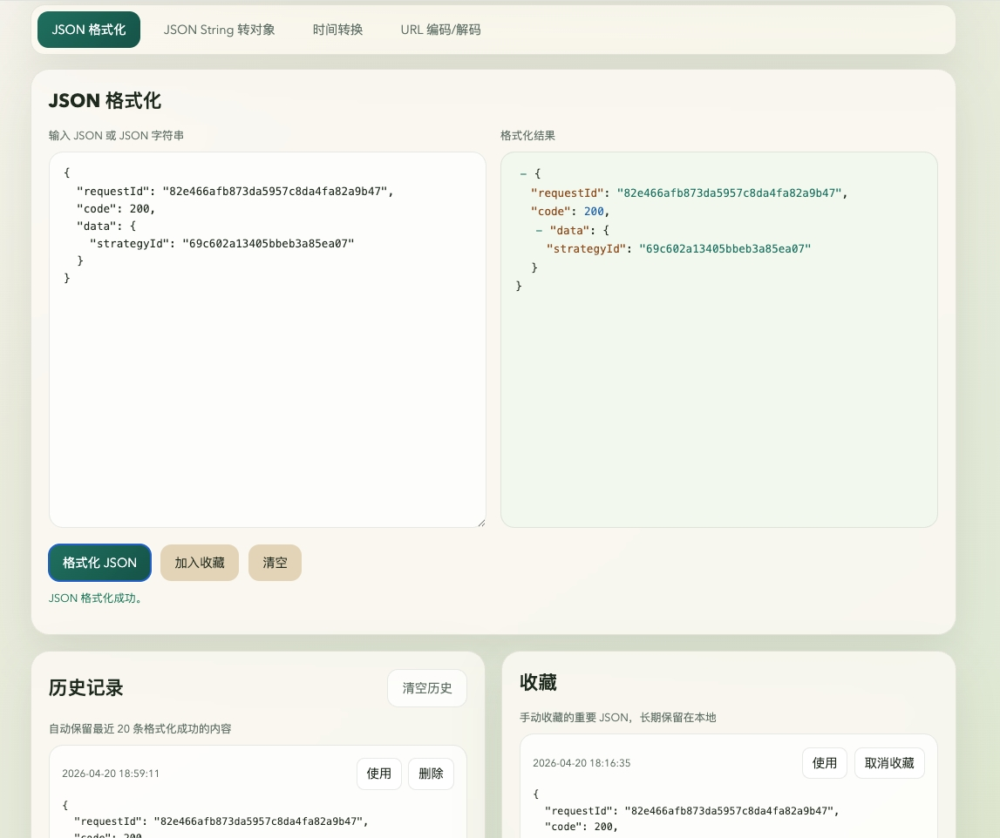

# LocalTools

一个可本地运行的前端开发小工具集合，适合在浏览器中快速处理 `JSON`、时间戳、时间格式和 `URL` 编码解码等常见需求。



## 功能

- `JSON` 格式化
- `JSON` 折叠/展开查看
- `JSON String` 转 `JSON` 对象
- `JSON` 输入记录自动保存
- `JSON` 格式化历史记录
- `JSON` 收藏
- 当前本地时间
- 当前 `UTC` 时间
- 当前秒级时间戳
- 当前毫秒级时间戳
- 时间戳转时间
- 时间转时间戳
- `URL Encode`
- `URL Decode`

## 特点

- 零第三方依赖
- 本地启动即可使用
- 数据保存在浏览器本地 `localStorage`
- 适合个人开发环境和离线使用

## 本地运行

要求：

- 已安装 `Node.js`

启动：

```bash
cd ~/localtools
npm start
```

启动后访问：

```text
http://127.0.0.1:3000
```

## 项目结构

```text
localtools/
├── package.json
├── server.js
├── README.md
├── toolsdemo.jpg
└── public/
    ├── index.html
    ├── styles.css
    └── app.js
```

## 技术实现

- 前端：原生 `HTML`、`CSS`、`JavaScript`
- 本地服务：`Node.js` 原生 `http` 模块
- 本地存储：浏览器 `localStorage`

## 说明

- 默认监听地址为 `127.0.0.1:3000`
- 如果需要局域网访问，可将 [server.js](~/localtools/server.js) 中的监听地址改为 `0.0.0.0`
- 当前项目适合直接部署为本地工具，也可以配合 `pm2`、`Nginx` 等方式做常驻运行
